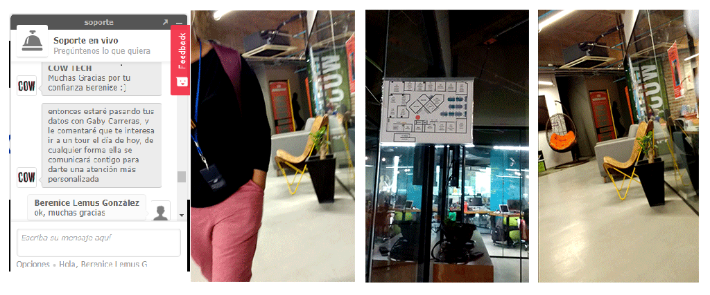
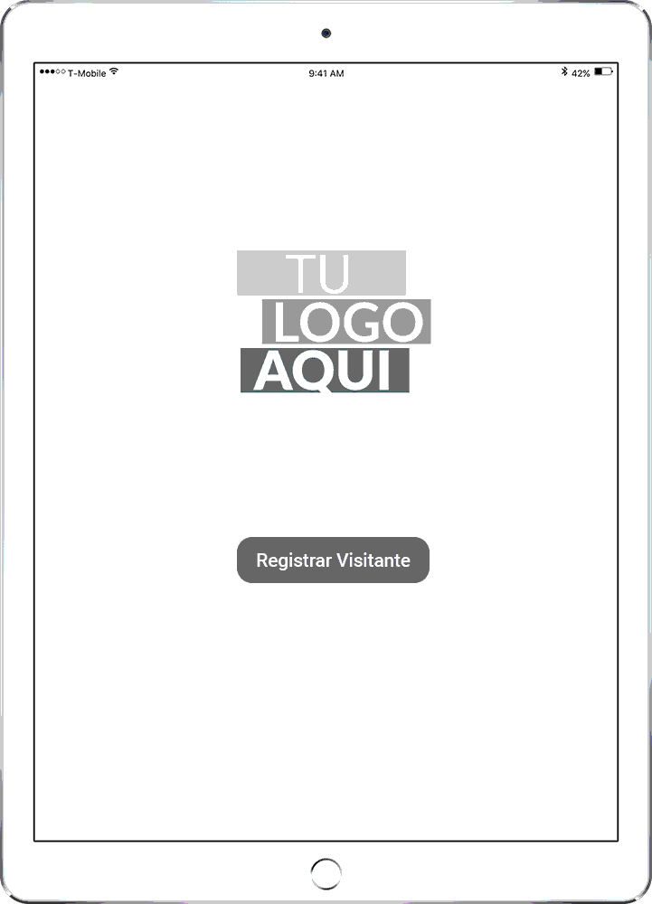

# Registro de Visitantes
---

## Preámbulo

En los últimos años el concepto novedoso, el Coworking, un espacio de trabajo compartido, 

## Introducción

## Objetivos

## Problemática Registro de visitantes

### Análisis del proceso de registro manual

* Registro de visitantes es manual haciéndolo una tarea tediosa y poco práctica para aquellos visitantes que llegan con prisa o tiempo limitado
* Se toma nota con papel y lápiz y es muy difícil tener información estadística de los visitantes que se reciben
* Por cuestiones de seguridad se debe pedir una identificación al visitante
* Los visitantes pierden tiempo valioso al momento de registrarse en un solo libro, sobre todo cuando van con el tiempo limitado antes de su cita
* Algunos visitantes se molestan al pedirles se registren porque no traen identificación por lo cuál se les restringen el acceso
* En ciertos casos se les permite pasar sólo si la persona a quien visitan autoriza el acceso

## Objetivos de implementar registro de visitantes digital

Objetivos primarios:

* Agiliza el proceso de ingreso  de visitantes y se optimiza la recolección de información
* Acorta el tiempo que toma la recolección de datos personales sin sacrificar la obtención de información necesaria
* Mejor control de quién accede al edificio y a qué zona ingresa
* Obtener datos que ayuden a controlar la seguridad del edificio
* Se obtienen datos como: Nombre Completo, teléfono, correo-e, lugar al que se dirige, persona que lo recibe e incluso fotografía
* Registro de entradas y salidas de visitantes
* Permite denegar acceso a visitantes específicos e identificarlo en futuras visitas

Objetivos secundarios:

* Estadísticas de visitas
* Permite conocer quiénes son los inquilinos que reciben más personas
* Saber el promedio de usuarios visitantes que se reciben cada día

## Problemática detectada

* Uno de los mayores problemas en la gestión de visitantes dentro de un coworking es la gran afluencia de visitantes que representa un reto para la organización.
* Proceso de registro sencillo pero ineficiente al momento de querer acceder a una visita específica en casos de afectación a la seguridad del lugar
* Una vez almacenados los libros de visita pueden ocupar un gran espacio
* No se puede detectar de manera automática visitantes no gratos
* No se cuentan con estadísticas de afluencia de visitantes
* La gran mayoría de los inquilinos del coworking cuentan con una idea de negocio que gira entorno al mundo digital, lo que obliga al coworking a modernizar y digitalizar sus porcesos de registro.

## Nuestra propuesta

## Proceso de Diseño

## Investigación del Registro de Visitas


Se analizaron algunos otros formatos de registro de visitas como referencia en el diseño de los priméros prototipos e identificar que datos se solicitan a los visitantes cuando se utiliza un medio digital para su recolección.


## Quién utiliza el registro de visitantes

### Tipos de Usuarios del Coworking

#### Usuarios visitantes


* **Socios comerciales** que se reúnen con usuarios de coworking, son jóvenes tienen distintas actividades agendadas durante el día, son nativos digitales tienen un smartphone siempre disponible
* **Postulantes a puestos de empleo** Acuden a entrevistas de trabajo


#### Usuarios Facilitadores


* Personal de Seguridad/Vigilancia
* Recepcionistas
* Administradores de Coworking

#### Usuarios Coworkers/Inquilinos

* Emprendedores
* Profesionistas independientes
* Startups
* Empresas pequeñas pueden compartir un espacio de trabajo

### Historias de Usuarios

|Historia de Usuario: Visitante|
|---|
|Yo como visitante quisiera poder registrar mi visita de manera rápida sin que me soliciten tanta información, poder avisar a la persona que visito que ya me encuentro en las instalaciones y que espero a que me reciba pronto. |

|Historia de Usuario: Recepcionista|
|---|
|-Como Recepcionista quiero que haya botones de regresar y continuar en la aplicación, para que los visitantes que no están acostumbrados a la tecnología, no se frustren al intentar registrarse.
-Yo como Recepcionista, quisiera poder tener una manera más eficaz de registrar los visitantes, sin que se formen largas filas por el tiempo que le toma a cada visitante registrarse en el libro de visitas manualmente.|

|Historia de Usuario: Vigilante|
|---|
|-Yo como vigilante/seguridad en un coworking quiero controlar la entrada de los visitantes
-Yo como vigilante/seguridad de un coworking quiero ver la hora de entrada de los visitantes
-Yo como vigilante/seguridad de un coworking quiero acceder a los datos de todos los visitantes
-Yo como vigilante/seguridad de un coworking quiero tener una clave de acceso a los datos de los visitantes
-Yo como vigilante/seguridad de un coworking quiero cerrar la sesión para que los datos de los visitantes no estén expuestos.|

|Historia de Usuario: Inquilino|
|---|
|-Yo como inquilino quiero que mis visitantes se registren
-Yo como inquilino quiero ser notificado cuando alguien me espera en recepción
-Yo como inquilino quiero recibir un reporte de los visitantes por dia o mes a mi oficina
-Yo como inquilino quiero que exista una recopilación de los visitantes en mi entorno de trabajo|

|Historia de Usuario: Administrador|
|---|
|Yo como Administrador, quisiera poder controlar la lista de visitas de una manera más esquematizada y práctica, aparte de poder identificar el rostro de los visitantes a través de fotografías previamente tomadas, por cuestiones de seguridad.
Como Recepcionista, quiero tener la seguridad de que ningún visitante que esté usando la aplicación, pueda ingresar a las páginas de acceso exclusivo para la administración.|

## Técnicas usadas en esta fase

### Entrevistas/Observación de usuarios de registro de visitantes

[Listado de preguntas planteadas para identificar la problemática y analizar el proceso de registro](https://drive.google.com/open?id=1sGjNL_agG9Tg4Xq5wBZgTYlSCpO1_gghZ4tOWxylrWI)

Se realizaron algunas entrevistas con usuarios encargados de solicitar y verificar se lleve a cabo el registro de visitas (usuarios facilitadores) de las cuales se obtuvo información importante sobre el proceso de registro, las notificaciones hacia los coworkers visitados y el uso que se le da a la información recopiladad durante el proceso de registro del visitante


### Cliente incógnito

Como cliente incógnito fuimos a visitar a COW Tonalá para poder experimentar su proceso de registro, sin embargo por cuestiones de remodelación de las instalaciones únicamente tenían disponible el registro tradicional, en el que personal de vigilancia solicitaba nuestras identificaciones y daba aviso a la persona que visitábamos, sin embargo nos contaron parte del proceso de registro y lo importante que es para ellos el tema de seguridad e identificación de cada visitante

>¿Cómo nos avisan de la entrada si tengo algún visitante?
>ah por medio de la tablet les llega un correo, tenemos un sistema para avisar que ya llegó su visita y que ya vienen en camino, Sibe acompañado de un guardia de seguridad, cuando no están ustedes no los deja pasar hasta que estén ustedes




## Criterios de diseño

El diseño se visualiza simple e intuitivo, sin pasos complicados, sobre fondos blancos que permitan una correcta lectura de la información y que no distraigan la atención de la tarea a realizar, se compone de elementos simples y minimalistas que permitan adecuarse a la identidad de cualquier coworking, por ello se ha creado una identidad con "TU LOGO AQUI" para indicar que puede ser altamente persoanilzado y adaptarse a los colores de la marca.




## Proceso de ideación


### Sketches Iniciales


### Prototipo Figma

[prototipo inicial test A](https://www.figma.com/proto/G3asB4JYfGdEuQuRWx917NRi/Propuestas-iniciales?node-id=1%3A2&scaling=scale-down)

[prototipo inicial test B](https://www.figma.com/proto/fcRAtXsfXP3GyxnNjGg65w/Propuestas-iniciales-(Test-B)?scaling=scale-down&node-id=1%3A2)

[prototipo alta fidelidad](https://www.figma.com/proto/PitEONoP9h94PZmqmKNeAf/Prototipo-Alta-Fidelidad?node-id=1%3A2&scaling=scale-down)


### Testing con usuarios

De los testing iniciales se obtuvieron algunas observacones de los usuarios indicando que sería mejor cambiar el órden de los campos a llenar iniciando con los datos personales del visitante, seguidos por los datos de la persona visitada, así como indicar con títulos a qué se refería cada bloque de datos


Para probar si era ideal poner el botón de acceso para administradores en la página de registro se hicieron pruebas A/B con usuarios, donde concluimos que podríamos colocar el link de login para administradores en la parte inferior de la ventana pero con un tono gris que le permitiera no ser tan visible. La mitad de los usuarios dijeron no haberlo percibido y la segunda mitad comentaron que les dió curiosidad darle click sin embargo nadie clickeo sobre el link. Por lo que concluimos que colocar el link de login para los administradores en la página de registro de visitantes les facilitaría acceder de una manera más fácil. 


## Boilerplate

```text
./
│
├── src
│   ├── css
│   │   └── main.css
│   ├── assets
|   |   └── images
|   |       ├── benchmark-registro.png
|   |       ├── documentacion-investigacion.png
|   |       ├── documentacion-investigacion2.png
|   |       ├── logo.png
|   |       ├── sketches-iniciales.png
|   |       └── testing-iniciales.jpeg
|   ├──js
|   |   ├── admin.js
|   |   ├── credentials.js
|   |   └── register.js
│   ├── views
│   |   ├── admin.html
│   |   ├── print.html
│   |   └── register.html
│   └── index.html
├── test
|   ├── data.spec.js
|   ├── headless.js
|   ├── index.html
|   └── test.js
├── .editorconfig
├── .eslintrc
├── .gitignore
├── package.json
├── package.json
└── README.md

```

## Tech y Framework implementado

* Javascript
* HTML
* CSS
* Shell/Bash
* Bootstrap 4
* Figma
* Awesome Fonts
* Node/NPM
* GitHub
* Visual Studio Code
* Firebase
* Firestore

## Tests

* ESlint
* HTMLhint
* Mocha

Para poder realizar los Test seguir estos pasos:

1. Descargar e instalar Visual Studio Code [aqui](https://code.visualstudio.com/download)
2. Descargar e instalar Git Bash [aquí](https://git-scm.com/downloads)
3. Descarcar e instalar Node.js [aquí](https://nodejs.org/en/download/)
4. Abrir la terminal de Git e ingresar este comando para instalar la dependencia:

```javascript
npm install -g
```

5. Realizar el siguiente comando para correr los test(ESlint, htmlhint, mocha):

```javascript
npm run test
```

6. Posteriormente se abre el index.html en la carpeta TEST para poder visualizar las pruebas en el navegador.

## ¿Cómo se usa?

1. Ingresar a la aplicación: <https://berynice.github.io/visitor-registration/src/index.html)>
2. En la página principal: Para entrar en la sección del registro de visitas, dar click en botón llamado "Registrar Visita". Para entrar en la sección de administración, dar click en el link hasta abajo, en medio, llamado "Log in"
3. Para acceder al Log in, utilizar los siguientes datos:
* Nombre de Usuario: admin
* Contraseña: admin

## Contribuir

1. Descargar e instalar Visual Studio Code [aqui](https://code.visualstudio.com/download)
2. Descargar e instalar Git Bash [aquí](https://git-scm.com/downloads)
3. Descargar e instalar Node.js [aquí](https://nodejs.org/en/download/)
4. Forkear el repositorio [aqui](https://berynice.github.io/visitor-registration/src/index.html)
5. Abrir la Terminal de Git Bash en la locación desdeada y ejecutar el siguiente comando para clonar el repositorio:

```javascript
git clone https://github.com/BeryNice/visitor-registration.git
```

6. Instalar npm.
7. Solicitar con un Pull Request al repositorio Master para poder dar unir la contribución.

Clonarlo el fork a la computadora donde se vaya a trabajar
Tener instalado Node.js
Instalar las dependencias del proyecto con el comando npm install
Archivos
El boilerplate de este proyecto contiene la siguiente estructura de archivos, así como toda la configuración de dependencias y tests:

## Desarrolladoras

* [Berenice Lemus González](https://github.com/BeryNice)
* [Génesis Mauries Enríquez](https://github.com/GenesisMauries)
* [Linda Tableros Gessner](https://github.com/lindatablerosgessner)