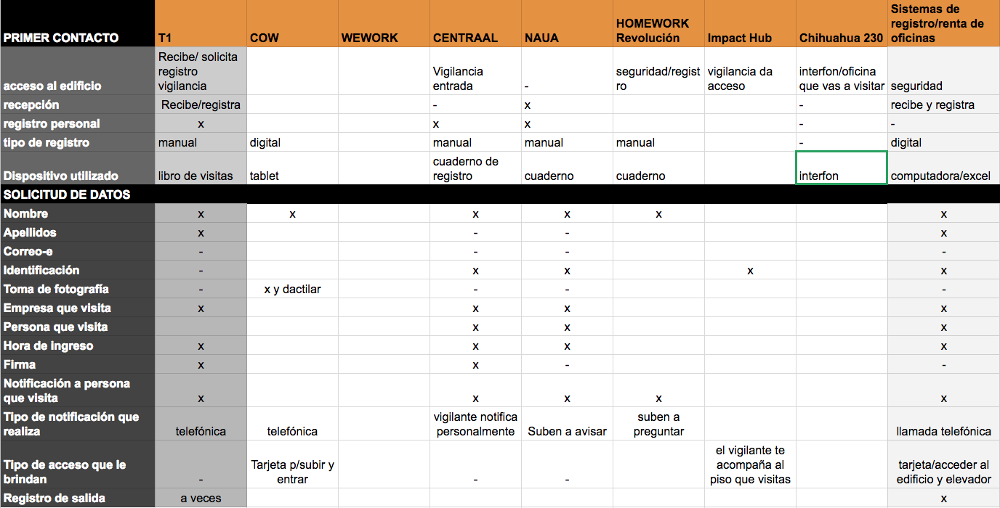

# Registro de Visitantes

---

## Problemática Registro de visitantes

### Análisis del proceso de registro manual

* Registro de visitantes es manual haciéndolo una tarea tediosa y poco práctica para aquellos visitantes que llegan con prisa o tiempo limitado
* Se toma nota con papel y lápiz y es muy difícil tener información estadística de los visitantes que se reciben
* Por cuestiones de seguridad se debe pedir una identificación al visitante
* Los visitantes pierden tiempo valioso al momento de registrarse en un solo libro, sobre todo cuando van con el tiempo limitado antes de su cita
* Algunos visitantes se molestan al pedirles se registren porque no traen identificación por lo cuál se les restringen el acceso
* En ciertos casos se les permite pasar sólo si la persona a quien visitan autoriza el acceso

## Objetivos de implementar registro de visitantes digital

Objetivos primarios:

* Agiliza el proceso de ingreso  de visitantes y se optimiza la recolección de información
* Acorta el tiempo que toma la recolección de datos personales sin sacrificar la obtención de información necesaria
* Mejor control de quién accede al edificio y a qué zona ingresa
* Obtener datos que ayuden a controlar la seguridad del edificio
* Se obtienen datos como: Nombre Completo, teléfono, correo-e, lugar al que se dirige, persona que lo recibe e incluso fotografía
* Registro de entradas y salidas de visitantes
* Permite denegar acceso a visitantes específicos e identificarlo en futuras visitas

Objetivos secundarios:

* Estadísticas de visitas
* Permite conocer quiénes son los inquilinos que reciben más personas
* Saber el promedio de usuarios visitantes que se reciben cada día

## Problemática detectada

* Uno de los mayores problemas en la gestión de visitantes dentro de un coworking es la gran afluencia de visitantes que representa un reto para la organización.
* Proceso de registro sencillo pero ineficiente al momento de querer acceder a una visita específica en casos de afectación a la seguridad del lugar
* Una vez almacenados los libros de visita pueden ocupar un gran espacio
* No se puede detectar de manera automática visitantes no gratos
* No se cuentan con estadísticas de afluencia de visitantes
* La gran mayoría de los inquilinos del coworking cuentan con una idea de negocio que gira entorno al mundo digital, lo que obliga al coworking a modernizar y digitalizar sus porcesos de registro.

## Nuestra propuesta

## Proceso de Diseño

## Investigación del Registro de Visitas

## Quién utiliza el registro de visitantes

### Tipos de Usuarios del Coworking

#### Usuarios visitantes

* **Socios comerciales** que se reúnen con usuarios de coworking, son jóvenes tienen distintas actividades agendadas durante el día, son nativos digitales tienen un smartphone siempre disponible
* **Postulantes a puestos de empleo** Acuden a entrevistas de trabajo

| Puntos débiles        | Desafíos cotidianos           |
| -------------         |:-------------:|

#### Usuarios Facilitadores

* Personal de Seguridad/Vigilancia
* Recepcionistas
* Administradores de Coworking

#### Usuarios Coworkers/Inquilinos

* Emprendedores
* Profesionistas independientes
* Startups
* Empresas pequeñas pueden compartir un espacio de trabajo

## Técnicas usadas en esta fase

### Entrevistas/Observación de usuarios de registro de visitantes

[Listado de preguntas planteadas para identificar la problemática y analizar el proceso de registro](https://drive.google.com/open?id=1sGjNL_agG9Tg4Xq5wBZgTYlSCpO1_gghZ4tOWxylrWI)

Se realizaron algunas entrevistas con usuarios encargados de solicitar y verificar se lleve a cabo el registro de visitas (usuarios facilitadores) de las cuales se obtuvo información importante sobre el proceso de registro, las notificaciones hacia los coworkers visitados y el uso que se le da a la información recopiladad durante el proceso de registro del visitante

## Criterios de diseño

Diseño simple e intuitivo, sin pasos complicados
Sobre fondos blancos que permitan una correcta lectura de la información y que no distraigan la atención de la tarea a realizar, elementos simples y minimalistas

## Proceso de ideación

### Sketches Iniciales

### Prototipo Figma

[prototipo inicial sprint 1](https://www.figma.com/proto/G3asB4JYfGdEuQuRWx917NRi/Propuestas-iniciales?node-id=1%3A2&scaling=scale-down)

### Testing con usuarios

